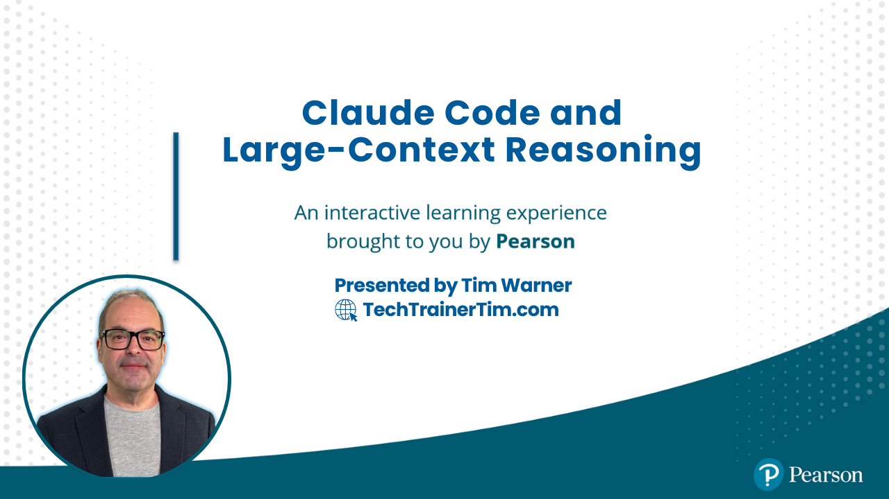

# Claude Code and Large-Context Reasoning



[](https://techtrainertim.com) [](https://github.com/timothywarner-org) [](https://nodejs.org/) [](https://www.typescriptlang.org/) [](LICENSE)

**O'Reilly Live Learning Course** | 4 Hours | Claude Code + MCP + Agents + Skills

Master Claude Code CLI, MCP servers, agentic workflows, and custom skills. This hands-on course takes you from installation to production-ready AI-assisted development workflows.

## Course Overview

| Segment | Focus | Difficulty | Key Skills |
|---------|-------|------------|------------|
| Segment 1 | Claude Code Quick Start | Beginner | Installation, CLI basics, terminal workflows |
| Segment 2 | MCP (Model Context Protocol) | Intermediate | Installing servers via CLI, memory persistence |
| Segment 3 | Agents | Intermediate | Agentic loops, autonomous operations, boundaries |
| Segment 4 | Skills + Agents | Advanced | Custom skills, production workflows, CI/CD |

## What You'll Build

A production-ready **Claude development environment** with persistent memory and custom automation:

| Component | Purpose | Capabilities |
|-----------|---------|--------------|
| **Claude Code Setup** | Terminal Workflows | Code review, refactoring, commit messages |
| **MCP Memory Server** | Persistent Context | Remembers decisions, entities, relationships |
| **Custom Skills** | Automation | Reusable slash commands for your team |
| **Agent Workflows** | Autonomous Operations | Multi-step tasks with proper boundaries |

## Prerequisites

- Basic programming knowledge (TypeScript/JavaScript examples used)
- Claude account (free tier works, Pro recommended for API features)
- VS Code or Cursor installed
- Comfortable with terminal/command line basics

**Required accounts and tools:**

| Resource | URL | Notes |
|----------|-----|-------|
| Claude Account | <https://claude.ai/> | Pro recommended for extended features |
| Anthropic API | <https://console.anthropic.com/> | For Claude Code CLI and API demos |
| GitHub Account | <https://github.com/> | For workflow integration demos |

## Repository Structure

```text
claude-code/
├── README.md                           # This file
├── CLAUDE.md                           # Claude Code instructions
├── package.json                        # Node.js dependencies
├── tsconfig.json                       # TypeScript configuration
├── .env.example                        # Environment template
│
├── src/
│   └── utils/
│       ├── client.ts                   # Anthropic client factory
│       └── logger.ts                   # Colorful logging utility
│
├── segment_1_quickstart/               # Claude Code Quick Start
│   ├── 01_installation.md              # Setup guide
│   ├── 02_verify_setup.ts              # Verify installation
│   └── 03_terminal_workflows.ts        # Basic CLI workflows
│
├── segment_2_mcp/                      # Model Context Protocol
│   ├── 01_mcp_quickstart.md            # MCP installation guide
│   ├── 02_mcp_architecture.ts          # Understanding MCP
│   └── memory_server/                  # JSON memory server
│       ├── server.ts
│       └── README.md
│
├── segment_3_agents/                   # Agentic Workflows
│   ├── 01_agents_intro.md              # Agent concepts
│   ├── 02_agent_loop.ts                # Plan-Execute-Observe loop
│   ├── 03_agent_boundaries.ts          # Permissions and safety
│   └── 04_custom_agents.md             # Building custom agents
│
├── segment_4_skills_agents/            # Skills + Agents
│   ├── 01_skills_intro.md              # Creating custom skills
│   └── 02_production_workflows.ts      # Code review, docs, releases
│
├── .claude/
│   ├── agents/                         # Custom agents (subagents)
│   │   ├── code-quality-coach.md       # Mentoring agent + code-review skill
│   │   ├── release-manager.md          # DevOps agent + deploy-prep skill
│   │   └── claude-code-tutor.md        # Teaching agent for this course
│   └── commands/                       # Custom slash commands (skills)
│       ├── code-review/                # Multi-file code review skill
│       │   ├── code-review.md          # Main workflow with frontmatter
│       │   ├── SECURITY_CHECKLIST.md   # OWASP Top 10 reference
│       │   ├── PERFORMANCE_GUIDE.md    # Performance patterns
│       │   └── scripts/                # Automated scanners
│       │       ├── security_scan.py
│       │       └── lint_check.py
│       └── deploy-prep/                # Multi-file deployment skill
│           ├── deploy-prep.md          # Main workflow
│           ├── CHANGELOG_FORMAT.md     # Formatting rules
│           ├── SEMVER_GUIDE.md         # Version guidance
│           ├── scripts/                # Automation scripts
│           │   ├── preflight_check.py
│           │   └── generate_changelog.py
│           └── templates/              # Release templates
│               └── RELEASE_TEMPLATE.md
│
└── docs/
    ├── SETUP.md                        # Detailed setup guide
    ├── TROUBLESHOOTING.md              # Common issues
    └── MCP_REFERENCE.md                # MCP quick reference
```

## Quick Start

1. **Clone the repository**

   ```bash
   git clone https://github.com/timothywarner-org/claude-code.git
   cd claude-code
   ```

2. **Install dependencies**

   ```bash
   npm install
   ```

3. **Configure environment**

   ```bash
   cp .env.example .env
   # Edit .env and add your ANTHROPIC_API_KEY
   ```

4. **Verify setup**

   ```bash
   npm run segment1:verify
   ```

5. **Run your first workflow**

   ```bash
   npm run segment1:workflows
   ```

## NPM Scripts

```bash
# Segment 1: Quick Start
npm run segment1:verify      # Verify Claude API setup
npm run segment1:workflows   # Terminal workflow demos

# Segment 2: MCP
npm run segment2:architecture  # MCP architecture visualization
npm run segment2:memory        # Start memory server

# Segment 3: Agents
npm run segment3:agent-loop   # Agent loop demonstration
npm run segment3:boundaries   # Permission boundaries demo

# Segment 4: Skills + Agents
npm run segment4:workflows    # Production workflow demos

# Utilities
npm run mcp:memory           # Start MCP memory server
npm run build                # Compile TypeScript
npm run lint                 # Run ESLint
npm run format               # Run Prettier
```

## Segment Summaries

### Segment 1: Claude Code Quick Start

**Scenario:** Get up and running with Claude Code CLI in minutes

**What you'll learn:**

- Installing Claude Code (`npm install -g @anthropic-ai/claude-code`)
- Essential CLI commands and flags
- Terminal workflows: streaming, code review, refactoring
- Configuration files (`.claude/settings.json`, `CLAUDE.md`)

**Key commands:**

```bash
claude                        # Start interactive session
claude "review this file"     # One-shot query
claude --model sonnet         # Choose model
claude --allowedTools "Read"  # Restrict tools
```

---

### Segment 2: MCP (Model Context Protocol)

**Scenario:** Give Claude persistent memory across sessions

**What you'll learn:**

- What MCP is and why it matters
- Installing MCP servers with the Claude CLI
- MCP primitives: Tools, Resources, Prompts
- Using our JSON memory server for persistent context

**Key commands:**

```bash
# Add memory server
claude mcp add memory -- npx tsx segment_2_mcp/memory_server/server.ts

# List installed servers
claude mcp list

# Use memory tools
> store_memory entity "UserService" content "Handles authentication"
> recall_memories query "authentication"
```

---

### Segment 3: Agents

**Scenario:** Let Claude work autonomously with proper boundaries

**What you'll learn:**

- What makes Claude "agentic"
- The agent loop: Plan → Execute → Observe → Adjust
- Permission levels and tool restrictions
- Creating custom agents (subagents)
- Agents that leverage Skills

**Permission levels:**

```bash
claude                                    # Default (confirms each action)
claude --allowedTools "Read,Glob,Grep"    # Read-only tools pre-approved
claude --dangerously-skip-permissions     # Full autonomy (use carefully!)
```

**Example agents included:**
- `code-quality-coach` - Mentoring agent that uses the code-review skill
- `release-manager` - DevOps agent that uses the deploy-prep skill
- `claude-code-tutor` - Teaching agent for learning Claude Code

---

### Segment 4: Skills + Agents

**Scenario:** Create reusable workflows and production integrations

**What you'll learn:**

- Creating custom skills with `.claude/commands/*.md`
- Dynamic arguments with `$ARGUMENTS`
- Production workflows: code review, documentation, releases
- CI/CD integration with GitHub Actions

**Example skills included:**

```
.claude/commands/
├── code-review/          # Security & performance review
│   ├── code-review.md    # Main workflow + frontmatter
│   ├── SECURITY_CHECKLIST.md
│   ├── PERFORMANCE_GUIDE.md
│   └── scripts/
│       ├── security_scan.py
│       └── lint_check.py
└── deploy-prep/          # Release preparation
    ├── deploy-prep.md
    ├── CHANGELOG_FORMAT.md
    ├── SEMVER_GUIDE.md
    ├── scripts/
    │   ├── preflight_check.py
    │   └── generate_changelog.py
    └── templates/
        └── RELEASE_TEMPLATE.md
```

Usage:
```bash
/project:code-review feature/auth    # Review a branch
/project:deploy-prep minor --dry-run # Prepare minor release
```

## Key Code Examples

### Claude API Client Setup

```typescript
import Anthropic from '@anthropic-ai/sdk';

const client = new Anthropic();  // Uses ANTHROPIC_API_KEY env var

const response = await client.messages.create({
  model: 'claude-sonnet-4-20250514',
  max_tokens: 1024,
  messages: [{ role: 'user', content: 'Review this code for security issues...' }]
});
```

### MCP Memory Server

```typescript
import { McpServer } from '@modelcontextprotocol/sdk/server/mcp.js';
import { z } from 'zod';

const server = new McpServer({ name: 'memory', version: '1.0.0' });

server.tool('store_memory', 'Store information', {
  entity: z.string(),
  content: z.string()
}, async ({ entity, content }) => {
  // Save to persistent storage
  return { content: [{ type: 'text', text: `Stored: ${entity}` }] };
});
```

### Advanced Skill with Frontmatter and Scripts

```markdown
<!-- .claude/commands/code-review/code-review.md -->
---
name: code-review
description: Comprehensive code review with security scanning
allowed-tools: Read, Glob, Grep, Bash(git:*, python:*)
argument-hint: "[branch|file|--staged]"
---

# Code Review Workflow

## Step 1: Run Automated Scans
```bash
python .claude/commands/code-review/scripts/security_scan.py
```

## Step 2: Manual Analysis
For security patterns, see [SECURITY_CHECKLIST.md](SECURITY_CHECKLIST.md)

## Step 3: Output Report
Generate JSON with issues, severity, and suggestions.
```

## Claude vs Copilot: When to Use Each

| Use Case | Claude | Copilot | Why |
|----------|--------|---------|-----|
| Full codebase analysis | **Yes** | No | 200K context vs ~8K |
| Persistent project memory | **Yes** (MCP) | No | MCP servers maintain state |
| Line-by-line autocomplete | No | **Yes** | Copilot optimized for inline |
| Complex refactoring | **Yes** | Limited | Claude reasons across files |
| Custom workflows | **Yes** (Skills) | No | Skills enable automation |

## Course Schedule

| Time | Activity |
|------|----------|
| 0:00 - 0:50 | Segment 1: Claude Code Quick Start |
| 0:50 - 1:00 | Q&A + Break |
| 1:00 - 1:50 | Segment 2: MCP (Model Context Protocol) |
| 1:50 - 2:00 | Q&A + Break |
| 2:00 - 2:50 | Segment 3: Agents |
| 2:50 - 3:00 | Q&A + Break |
| 3:00 - 3:50 | Segment 4: Skills + Agents |
| 3:50 - 4:00 | Wrap-up, resources, next steps |

## Learning Resources

### Claude Documentation

- [Claude Documentation](https://docs.anthropic.com/)
- [Model Context Protocol](https://modelcontextprotocol.io/)
- [Claude Code CLI](https://docs.anthropic.com/en/docs/claude-code)
- [Anthropic API Reference](https://docs.anthropic.com/en/api)

### Related O'Reilly Content

- [How to Prompt Like a Pro](https://learning.oreilly.com/search/?q=tim%20warner%2C%20how%20to%20prompt%20like%20a%20pro&type=live-course) — Tim Warner
- [GitHub Copilot for Developers](https://www.oreilly.com/library/view/github-copilot-for/9780135382813/) — Tim Warner
- [Prompt Engineering for Generative AI](https://www.oreilly.com/library/view/prompt-engineering-for/9781098153427/) — James Phoenix & Mike Taylor

## Troubleshooting

See [TROUBLESHOOTING.md](docs/TROUBLESHOOTING.md) for common issues.

**Quick fixes:**

```bash
# API key issues
echo $ANTHROPIC_API_KEY  # Verify it's set

# Claude Code not found
npm install -g @anthropic-ai/claude-code

# MCP server won't start
npm run mcp:memory

# Dependency issues
rm -rf node_modules && npm install

# Verify setup
npm run segment1:verify
```

## Instructor

**Tim Warner** — Microsoft MVP (Azure AI and Cloud/Datacenter Management), Microsoft Certified Trainer (25+ years)

- [LinkedIn](https://www.linkedin.com/in/intrepidtechie/)
- [Website](https://techtrainertim.com/)
- [O'Reilly Author Page](https://learning.oreilly.com/search/?query=Tim%20Warner)

## License

MIT License - See [LICENSE](./LICENSE) for details.

---

**Questions?** Open an issue or reach out via the course chat during live sessions.
