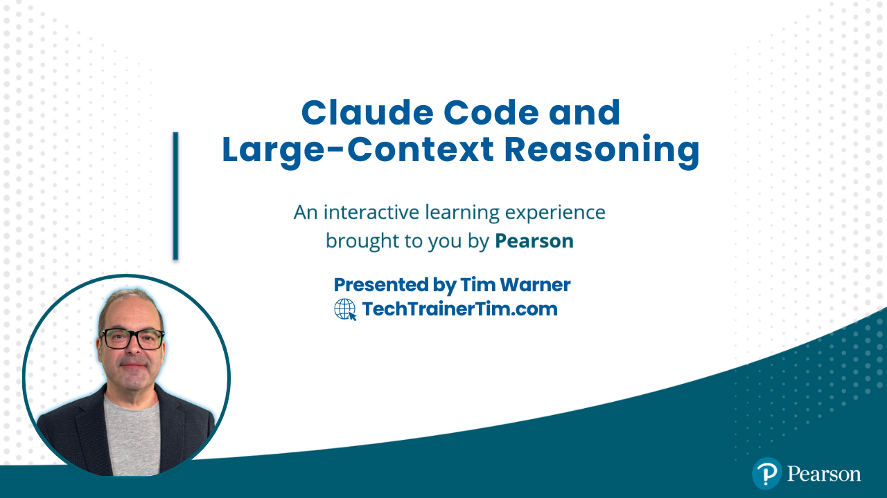

<!-- Last modified: 2026-05-25 -->

# Claude Code and Large-Context Reasoning



[](https://techtrainertim.com) [](https://github.com/timothywarner-org) [](https://nodejs.org/) [](https://www.typescriptlang.org/) [](LICENSE)

**O'Reilly Live Learning Course** | 4 Hours | Claude Code + MCP + Agents + Skills

Master Claude Code CLI, MCP servers, agentic workflows, and custom skills. This hands-on course takes you from installation to production-ready AI-assisted development workflows.

## Course Overview

The arc is **Zero -> Context -> Agents -> Hero**. Each segment builds on the last.

| Segment | Focus | Difficulty | Key Skills |
|---------|-------|------------|------------|
| 1 - Zero | Claude Code Quick Start | Beginner | Install, CLI basics, your first CLAUDE.md |
| 2 - Context | CLAUDE.md at Every Scope | Beginner -> Intermediate | Hierarchy, imports, context engineering |
| 3 - Agents | Autonomy with Boundaries | Intermediate | Agent loop, `--allowedTools`, subagents |
| 4 - Hero | Skills, Subagents, and Reach | Intermediate -> Advanced | Dynamic context injection, subagents, consuming MCP |

## What You'll Build

A production-ready **Claude development environment** built on the CLAUDE.md hierarchy:

| Component | Purpose | Capabilities |
|-----------|---------|--------------|
| **CLAUDE.md Hierarchy** | Project memory at three scopes | User, project, and subdirectory rules with `@path/file.md` imports |
| **Boundary Spec** | Real-time agent kill switch | Markdown-defined deny lists, edited live |
| **Custom Skills** | Reusable workflows | Slash commands with dynamic context injection (`` !`bash` ``) |
| **Subagents** | Isolated context, parallel reasoning | Frontmatter-scoped tools, models, and skills |
| **MCP Consumption** | Reach beyond the repo | Pre-wired `microsoft-learn` server, optional build-your-own FastMCP example |

## Prerequisites

- Basic programming knowledge (TypeScript/JavaScript examples used)
- Claude account (free tier works, Pro recommended for API features)
- VS Code or Cursor installed
- Comfortable with terminal/command line basics

**Required accounts and tools:**

| Resource | URL | Notes |
|----------|-----|-------|
| Claude Account | <https://claude.ai/> | Pro recommended for extended features |
| Anthropic API | <https://console.anthropic.com/> | For Claude Code CLI and API demos |
| GitHub Account | <https://github.com/> | For workflow integration demos |

## Repository Structure

```text
claude-code/
├── README.md                           # This file
├── CLAUDE.md                           # Claude Code instructions
├── package.json                        # Node.js dependencies
├── tsconfig.json                       # TypeScript configuration
├── .env.example                        # Environment template
│
├── src/
│   └── utils/
│       ├── client.ts                   # Anthropic client factory
│       └── logger.ts                   # Colorful logging utility
│
├── segment_1_quickstart/               # Zero: install + first CLAUDE.md
│   ├── 01_installation.md              # Setup + smallest useful CLAUDE.md
│   ├── 02_verify_setup.ts              # Verify installation
│   ├── 03_terminal_workflows.ts        # Basic CLI workflows
│   └── CLAUDE.md                       # Segment 1 subdirectory rules
│
├── segment_2_context/                  # Context: CLAUDE.md at every scope
│   ├── 01_claude_md_at_every_scope.md  # The load-bearing lesson
│   └── CLAUDE.md                       # Lives as a worked example
│
├── segment_3_agents/                   # Agents: autonomy with boundaries
│   ├── 01_agents_intro.md              # Agent loop, --allowedTools, kill switch
│   ├── 02_agent_loop.ts                # Plan-Execute-Observe loop
│   ├── 03_agent_boundaries.ts          # Permissions and safety
│   ├── 04_custom_agents.md             # Subagents (Part 2)
│   └── CLAUDE.md                       # Boundary spec (the lesson, live)
│
├── segment_4_hero/                     # Hero: skills, subagents, MCP consumption
│   ├── 01_skills_intro.md              # Skills with dynamic context injection
│   ├── 02_mcp_architecture.ts          # MCP architecture (advanced reference)
│   ├── 02_production_workflows.ts      # Code review, docs, releases
│   ├── 04_mcp_consumption.md           # Consume the microsoft-learn server
│   ├── MCP_SPEC_CHANGELOG.md           # Spec history for advanced learners
│   ├── memory_server/                  # Optional: build-your-own FastMCP
│   └── CLAUDE.md                       # Segment 4 subdirectory rules
│
├── demos/                              # Live walkthrough punchlists
│   ├── segment_1_zero_punchlist.md
│   ├── segment_2_context_punchlist.md
│   ├── segment_3_agents_punchlist.md
│   ├── segment_4_hero_punchlist.md
│   └── mcp-server-demo-punchlist.md    # Optional: build-your-own MCP
│
├── .claude/
│   ├── settings.json                   # Project MCP wiring (microsoft-learn)
│   ├── agents/                         # Subagents
│   │   ├── code-quality-coach.md
│   │   ├── release-manager.md
│   │   ├── claude-code-tutor.md
│   │   ├── python-mcp-expert.md
│   │   └── terraform-architect.md
│   └── skills/                         # Custom skills (canonical location)
│       └── mcp-scaffold/               # FastMCP server scaffolding
│
└── docs/
    ├── SETUP.md                        # Detailed setup guide
    ├── TROUBLESHOOTING.md              # Common issues
    └── MCP_REFERENCE.md                # MCP quick reference
```

## Quick Start

1. **Clone the repository**

   ```bash
   git clone https://github.com/timothywarner-org/claude-code.git
   cd claude-code
   ```

2. **Install dependencies**

   ```bash
   npm install
   ```

3. **Configure environment**

   ```bash
   cp .env.example .env
   # Edit .env and add your ANTHROPIC_API_KEY
   ```

4. **Verify setup**

   ```bash
   npm run segment1:verify
   ```

5. **Run your first workflow**

   ```bash
   npm run segment1:workflows
   ```

## NPM Scripts

```bash
# Segment 1: Quick Start
npm run segment1:verify      # Verify Claude API setup
npm run segment1:workflows   # Terminal workflow demos

# Segment 2: Context (CLAUDE.md at every scope)
# No npm scripts — the lesson is markdown and live demos. See:
#   segment_2_context/01_claude_md_at_every_scope.md
#   demos/segment_2_context_punchlist.md

# Segment 3: Agents
npm run segment3:agent-loop   # Agent loop demonstration
npm run segment3:boundaries   # Permission boundaries demo

# Segment 4: Hero (skills, subagents, MCP consumption)
npm run segment4:workflows     # Production workflow demos
npm run segment4:architecture  # MCP architecture (advanced reference)
npm run segment4:memory        # Start optional Python FastMCP memory server

# Utilities
npm run mcp:memory           # Start MCP memory server (same as above)
npm run build                # Compile TypeScript
npm run lint                 # Run ESLint
npm run format               # Run Prettier
```

## Segment Summaries

### Segment 1: Zero — Claude Code Quick Start

**Cold open:** "You just told Claude about your project. Congratulations, it forgot the moment you closed the terminal."

**What you'll learn:**

- Installing Claude Code (`npm install -g @anthropic-ai/claude-code`)
- Essential CLI commands, flags, and model aliases
- Writing the **smallest useful `CLAUDE.md`** at the repo root
- Verifying Claude reads it on every turn

**Key commands:**

```bash
claude                        # Start interactive session
claude "review this file"     # One-shot query
claude --model sonnet         # Resolves to the latest Sonnet
claude --allowedTools "Read"  # Restrict tools
```

---

### Segment 2: Context — CLAUDE.md at Every Scope

**Cold open:** "You explained your tech stack on Monday. On Tuesday, Claude was guessing again. The fix is not just one CLAUDE.md — it's CLAUDE.md at the right scope."

**What you'll learn:**

- The three-scope cascade: user, project, subdirectory
- The `@path/file.md` import trick for splitting fat CLAUDE.md files
- Five real CLAUDE.md files shipped in this repo as a worked example
- Context engineering as disciplined CLAUDE.md authoring

**No new commands** — the lesson lives entirely in the markdown hierarchy. Walk the punchlist at `demos/segment_2_context_punchlist.md`.

---

### Segment 3: Agents — Autonomy with Boundaries

**Cold open:** "You can let Claude drive ten tools in a row without asking. That is an agent. The same trick that saves you an hour can torch your branch in thirty seconds."

**What you'll learn:**

- The agent loop: Plan -> Execute -> Observe -> Adjust
- Two autonomy levers: `--allowedTools` and a CLAUDE.md boundary spec
- Subagents with isolated context windows (Part 2 of the story)
- The CLAUDE.md kill switch you can edit in real time

**Permission levels:**

```bash
claude                                    # Default (confirms each action)
claude --allowedTools "Read,Glob,Grep"    # Read-only tools pre-approved
claude --dangerously-skip-permissions     # Full autonomy (throwaway branches only)
```

**Example agents shipped:**
- `code-quality-coach` — Mentoring agent + code-review skill
- `release-manager` — DevOps agent + deploy-prep skill
- `claude-code-tutor` — Teaching agent for this course
- `python-mcp-expert` — Pair for FastMCP server building
- `terraform-architect` — IaC expert for Azure infrastructure

---

### Segment 4: Hero — Skills, Subagents, and Reach

**Cold open:** "A skill is the answer to 'I just typed this exact 12-step prompt for the fourth time.'"

**What you'll learn:**

- **Skills** with dynamic context injection (`` !`bash` ``), `${CLAUDE_SKILL_DIR}`, and `context: fork`
- **Subagents** in `.claude/agents/` with frontmatter-scoped tools and models
- **MCP consumption**: query the `microsoft-learn` server already wired into `.claude/settings.json`
- Optional homework: build your own FastMCP server (see `segment_4_hero/memory_server/`)

**Skill anatomy** (`.claude/skills/<name>/SKILL.md` is canonical; `.claude/commands/` still works for back-compat):

```yaml
---
name: review-changes
description: Review my uncommitted changes for bugs and missing tests
allowed-tools: Read, Glob, Grep
---

## Current diff
!`git diff HEAD`

## Your task
Flag bugs, anti-patterns, and missing tests.
```

The `` !`git diff HEAD` `` runs at render time, before Claude sees the prompt.

## Key Code Examples

### Claude API Client Setup

```typescript
import Anthropic from '@anthropic-ai/sdk';

const client = new Anthropic();  // Uses ANTHROPIC_API_KEY env var

const response = await client.messages.create({
  model: 'claude-sonnet-4-6',
  max_tokens: 1024,
  messages: [{ role: 'user', content: 'Review this code for security issues...' }]
});
```

### Consuming an MCP Server (Segment 4)

The `microsoft-learn` server is pre-wired in `.claude/settings.json`. Inside a Claude Code session:

```text
> /mcp                        # Browse registered servers
> Use the microsoft-learn server to find the GA version of AKS today.
```

Claude calls `microsoft_docs_search`, then optionally `microsoft_docs_fetch` for depth. No server code to write — just consume.

### Building Your Own MCP Server (Optional Homework)

```python
# segment_4_hero/memory_server/server.py (excerpt)
from fastmcp import FastMCP

mcp = FastMCP("memory")

@mcp.tool()
def remember_decision(title: str, decision: str) -> str:
    """Persist a project decision to local JSON."""
    # ... save to ./data/memory.json
    return f"Saved: {title}"
```

Register it:

```bash
claude mcp add memory -- bash segment_4_hero/memory_server/start.sh
```

### Advanced Skill with Frontmatter and Dynamic Context Injection

```markdown
<!-- .claude/skills/pr-summary/SKILL.md -->
---
name: pr-summary
description: Summarize the current pull request
allowed-tools: Bash(gh *)
---

## Pull request context
- PR diff: !`gh pr diff`
- PR comments: !`gh pr view --comments`
- Changed files: !`gh pr diff --name-only`

## Your task
Summarize the PR. Flag risks. Suggest reviewers.
```

Three `gh` commands run at render time. Claude only sees the rendered prompt with real PR data inlined.

## Claude vs Copilot: When to Use Each

| Use Case | Claude | Copilot | Why |
|----------|--------|---------|-----|
| Full codebase analysis | **Yes** | No | 1M context vs ~8K |
| Persistent project memory | **Yes** (CLAUDE.md + MCP) | No | Markdown hierarchy + MCP servers |
| Line-by-line autocomplete | No | **Yes** | Copilot optimized for inline |
| Complex refactoring | **Yes** | Limited | Claude reasons across files |
| Custom workflows | **Yes** (Skills) | No | Skills enable automation |

## Course Schedule

| Time | Activity |
|------|----------|
| 0:00 - 0:50 | Segment 1: Zero (Claude Code Quick Start) |
| 0:50 - 1:00 | Q&A + Break |
| 1:00 - 1:50 | Segment 2: Context (CLAUDE.md at Every Scope) |
| 1:50 - 2:00 | Q&A + Break |
| 2:00 - 2:50 | Segment 3: Agents (Autonomy with Boundaries) |
| 2:50 - 3:00 | Q&A + Break |
| 3:00 - 3:50 | Segment 4: Hero (Skills, Subagents, MCP Consumption) |
| 3:50 - 4:00 | Wrap-up, capstone, next steps |

## Learning Resources

### Claude Documentation

- [Claude Documentation](https://docs.anthropic.com/)
- [Model Context Protocol](https://modelcontextprotocol.io/)
- [Claude Code CLI](https://docs.anthropic.com/en/docs/claude-code)
- [Anthropic API Reference](https://docs.anthropic.com/en/api)

### Related O'Reilly Content

- [How to Prompt Like a Pro](https://learning.oreilly.com/search/?q=tim%20warner%2C%20how%20to%20prompt%20like%20a%20pro&type=live-course) — Tim Warner
- [GitHub Copilot for Developers](https://www.oreilly.com/library/view/github-copilot-for/9780135382813/) — Tim Warner
- [Prompt Engineering for Generative AI](https://www.oreilly.com/library/view/prompt-engineering-for/9781098153427/) — James Phoenix & Mike Taylor

## Troubleshooting

See [TROUBLESHOOTING.md](docs/TROUBLESHOOTING.md) for common issues.

**Quick fixes:**

```bash
# API key issues
echo $ANTHROPIC_API_KEY  # Verify it's set

# Claude Code not found
npm install -g @anthropic-ai/claude-code

# MCP server won't start
npm run mcp:memory

# Dependency issues
rm -rf node_modules && npm install

# Verify setup
npm run segment1:verify
```

## Instructor

**Tim Warner** — Microsoft MVP (Azure AI and Cloud/Datacenter Management), Microsoft Certified Trainer (25+ years)

- [LinkedIn](https://www.linkedin.com/in/intrepidtechie/)
- [Website](https://techtrainertim.com/)
- [O'Reilly Author Page](https://learning.oreilly.com/search/?query=Tim%20Warner)

## License

MIT License - See [LICENSE](./LICENSE) for details.

---

**Questions?** Open an issue or reach out via the course chat during live sessions.
