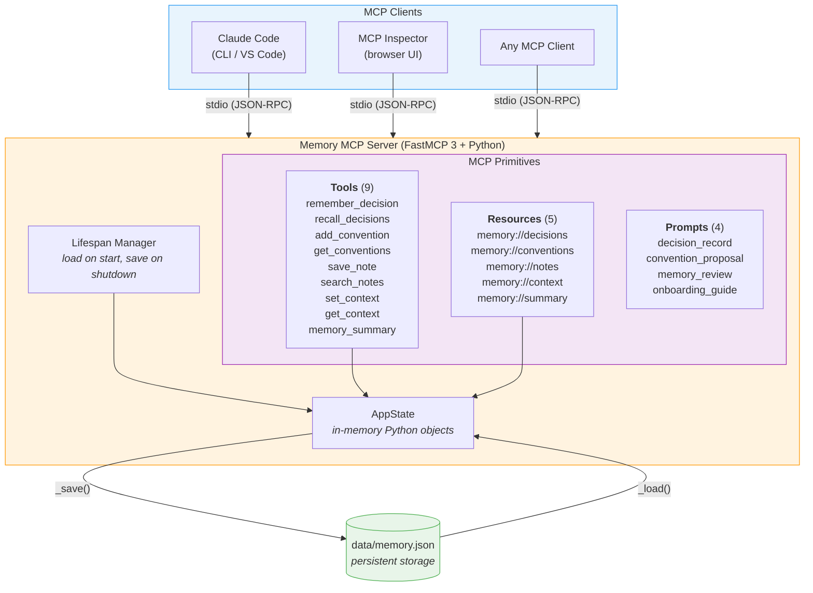
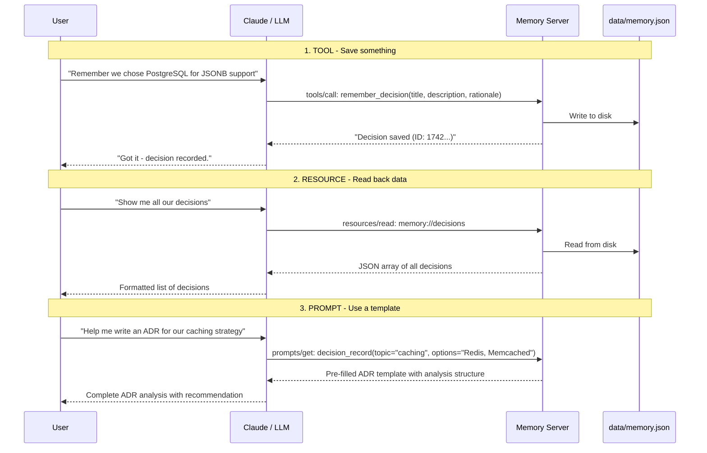
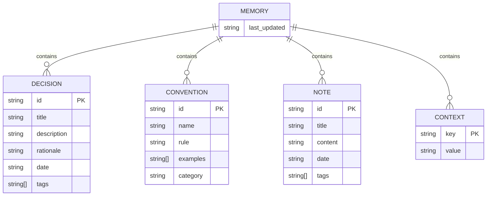
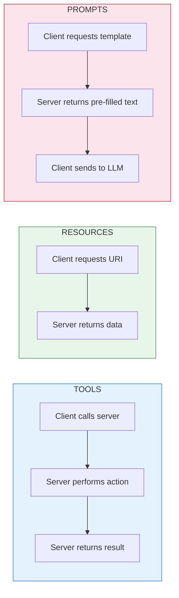
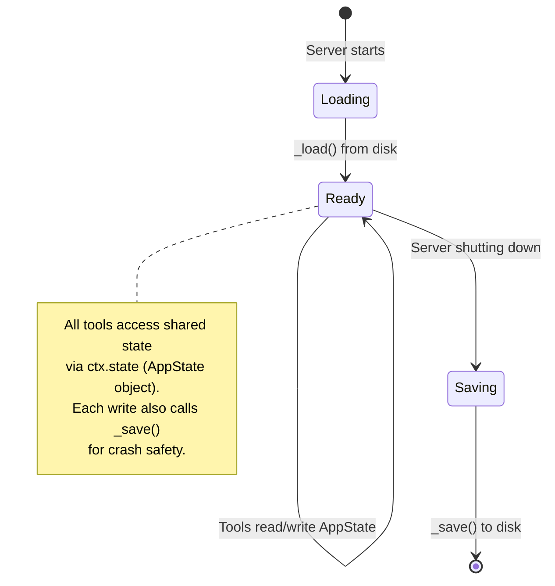

# Memory MCP Server

A grab-and-go MCP server that persists conversation context to local JSON.
Say **"remember this"** and it gets archived. Say **"what did we decide?"**
and it comes back.

Built with [FastMCP 3](https://gofastmcp.com) + [UV](https://docs.astral.sh/uv/)
for zero-friction setup.

## Architecture



## How the Three MCP Primitives Work Together



## What's Inside

### Tools (9) - Actions the LLM Can Execute

| Tool | What It Does |
|------|-------------|
| `remember_decision` | Save an architectural/design decision with rationale and tags |
| `recall_decisions` | Search past decisions by keyword or tag |
| `add_convention` | Record a coding convention with rule and examples |
| `get_conventions` | List conventions, optionally filtered by category |
| `save_note` | Save a freeform note - the "remember this" tool |
| `search_notes` | Search notes by keyword |
| `set_context` | Store a key-value pair (project metadata) |
| `get_context` | Retrieve one key or the full context dictionary |
| `memory_summary` | Quick overview: counts and last-updated timestamp |

### Resources (5) - Read-Only Data the LLM Can Pull

| URI | Description |
|-----|-------------|
| `memory://decisions` | All decisions as JSON |
| `memory://conventions` | All conventions as JSON |
| `memory://notes` | All notes as JSON |
| `memory://context` | Key-value context as JSON |
| `memory://summary` | Item counts and metadata |

### Prompts (4) - Reusable Templates

| Prompt | Parameters | Description |
|--------|------------|-------------|
| `decision_record` | `topic`, `options`, `constraints?` | Generate an Architecture Decision Record (ADR) |
| `convention_proposal` | `name`, `problem` | Draft a new coding convention |
| `memory_review` | _(none)_ | Review all memory for gaps and conflicts |
| `onboarding_guide` | `role?` | Create a new-member onboarding doc from stored memory |

## Prerequisites

You need two things installed:

1. **Python 3.11+** - [python.org/downloads](https://www.python.org/downloads/)
2. **UV** - The fast Python package manager

```bash
# Install UV (if you don't have it)
# macOS / Linux:
curl -LsSf https://astral.sh/uv/install.sh | sh

# Windows (PowerShell):
powershell -ExecutionPolicy ByPass -c "irm https://astral.sh/uv/install.ps1 | iex"
```

That's it. UV handles the virtual environment and all dependencies automatically.

## Tutorial 1: MCP Inspector (Interactive Testing)

MCP Inspector is a browser-based UI that lets you explore and test any MCP
server interactively. This is the best way to understand what the server
offers before connecting it to Claude Code.

### Step 1: Start the Inspector

```bash
cd segment_4_hero/memory_server
uv run -- fastmcp dev server.py
```

This does three things:

1. Creates a `.venv` and installs dependencies (first run only)
2. Starts the memory server
3. Opens MCP Inspector at `http://localhost:6274` in your browser

### Step 2: Explore the Tools Tab

In the Inspector UI, click the **Tools** tab. You'll see all 9 tools with
their descriptions, parameter schemas, and input types. Try this:

1. Click **`save_note`**
2. Fill in the parameters:
   - `title`: "My first memory"
   - `content`: "Testing the memory server from MCP Inspector"
   - `tags`: `["test", "inspector"]`
3. Click **Run**
4. You should see: `Note saved: 'My first memory' (ID: ...)`

Now try **`search_notes`** with query `"first"` - your note should come back.

### Step 3: Browse the Resources Tab

Click the **Resources** tab. You'll see 5 URIs:

1. Click **`memory://notes`** - you'll see the JSON for the note you just saved
2. Click **`memory://summary`** - you'll see `{ "notes": 1, ... }`

Resources are read-only views of the data. They're how an LLM can pull
context into its conversation without calling a tool.

### Step 4: Try the Prompts Tab

Click the **Prompts** tab. Try this:

1. Click **`decision_record`**
2. Fill in:
   - `topic`: "Database choice for user profiles"
   - `options`: "PostgreSQL, MongoDB, DynamoDB"
   - `constraints`: "Must support ACID transactions, team knows SQL"
3. Click **Get Prompt**

You'll see the pre-filled template that would be sent to the LLM. Prompts
don't execute anything - they generate structured input for the model.

### Step 5: Verify Persistence

Stop the Inspector (`Ctrl+C`), then start it again. Your data is still
there because it's persisted to `data/memory.json`. Open that file to
see the raw JSON.

## Tutorial 2: Using with Claude Code

### Option A: Register it yourself (Recommended)

This memory server is **optional build-your-own homework**, so it is **not** pre-registered in the repo. The pre-registered demo servers (`microsoft-learn`, `DocumentMCP-ClaudeCode`, `github`) live in `.mcp.json` at the repo root. To add this one:

```bash
# Positional stdio form (recommended)
claude mcp add memory -- bash segment_4_hero/memory_server/start.sh

# JSON-config alternative (same result, more portable)
claude mcp add-json memory '{"type":"stdio","command":"bash","args":["segment_4_hero/memory_server/start.sh"]}'
```

Then start Claude Code and verify it connected:

```bash
claude
claude mcp list
```

You should see `memory` in the list. Project-scoped servers prompt for a one-time approval on first launch.

### Option B: Add it to `.mcp.json` for the whole team

To share the server with anyone who clones the repo, add it to `.mcp.json` at the repo root (the location the CLI reads project MCP servers from - **not** `.claude/settings.json`):

```json
{
  "mcpServers": {
    "memory": {
      "type": "stdio",
      "command": "bash",
      "args": ["${CLAUDE_PROJECT_DIR:-.}/segment_4_hero/memory_server/start.sh"]
    }
  }
}
```

### Using the Memory Server in a Session

Once connected, just talk naturally. Claude will call the right tools:

```
You:  "Remember that we decided to use FastMCP 3 for all new servers
       because it ships with Streamable HTTP and elicitation support"

Claude: I've saved that decision.
        [called remember_decision with title="Use FastMCP 3 for new servers",
         rationale="Native Streamable HTTP transport + elicitation API in 3.x"]

You:  "What decisions have we recorded?"

Claude: Here's what we have so far:
        [called recall_decisions]
        1. Use FastMCP 3 for new servers (2026-05-25)
           Reason: Native Streamable HTTP transport + elicitation API in 3.x

You:  "Add a convention: always pin major versions in requirements"

Claude: Convention saved.
        [called add_convention with name="Pin major versions",
         rule="Always use >= and < constraints, e.g. >=3.0.0,<4.0.0",
         category="dependencies"]

You:  "Give me a summary of everything in memory"

Claude: [called memory_summary]
        Decisions: 1 | Conventions: 1 | Notes: 0 | Context keys: 0

You:  "Help me write an ADR for choosing between REST and GraphQL"

Claude: [uses decision_record prompt template]
        # ADR: API Style - REST vs GraphQL
        ## Options
        ...analysis using the structured template...
```

### Using Prompts in Claude Code

The 4 prompt templates are available as slash commands. In a Claude Code
session, you can reference them:

```
You:  "Use the memory_review prompt to audit our knowledge base"

Claude: [fetches memory_review prompt, reads all resources, produces report]

You:  "Generate an onboarding guide for a new frontend developer"

Claude: [fetches onboarding_guide prompt with role="frontend developer",
         reads all resources, generates tailored guide]
```

## Data Model



All data lives in a single `data/memory.json` file. Here's what it looks
like after a few interactions:

```json
{
  "decisions": [
    {
      "id": "1742313600-a1b2c3d4",
      "title": "Use FastMCP 3 for all new MCP servers",
      "description": "Standardize on FastMCP 3.x for new server development",
      "rationale": "FastMCP 3 ships with Streamable HTTP transport and elicitation support",
      "date": "2026-05-25T16:00:00+00:00",
      "tags": ["mcp", "python", "dependencies"]
    }
  ],
  "conventions": [
    {
      "id": "1742313700-e5f6a7b8",
      "name": "Pin major versions",
      "rule": "Always use >=X.0.0,<Y.0.0 constraints in requirements",
      "examples": ["fastmcp>=3.0.0,<4.0.0"],
      "category": "dependencies"
    }
  ],
  "notes": [],
  "context": {
    "primary_language": "Python",
    "framework": "FastMCP"
  },
  "last_updated": "2026-03-18T16:05:00+00:00"
}
```

## Project Structure

```
memory_server/
├── server.py          # The MCP server - single file, ~400 lines
├── pyproject.toml     # UV/pip dependency specification
├── uv.lock            # Locked dependency versions (auto-generated)
├── .gitignore         # Ignores data/, .venv/, __pycache__/
├── README.md          # This file
└── data/
    └── memory.json    # Created on first run (gitignored)
```

## Configuration

| Env Variable | Default | Description |
|-------------|---------|-------------|
| `MCP_MEMORY_PATH` | `./data/memory.json` | Path to the JSON storage file |

Example: store memory in a shared location:

```bash
MCP_MEMORY_PATH=/shared/project-memory.json uv run python server.py
```

## Key Concepts for Learners

### The Three MCP Primitives

Every MCP server is built from exactly three types of capabilities:



| Primitive | Analogy | Direction | When to Use |
|-----------|---------|-----------|-------------|
| **Tool** | A function call | Client -> Server -> Client | When the LLM needs to _do_ something (save, search, compute) |
| **Resource** | A GET endpoint | Client <- Server | When the LLM needs to _read_ data (pull context, check state) |
| **Prompt** | A template | Server -> Client | For guiding the LLM through a structured workflow |

### Why All Three Matter

- **Tools alone** would work, but resources give the LLM a way to browse
  available data without side effects, and prompts let the server author
  define reusable workflows.

- **Resources alone** are read-only - you can't save anything.

- **Prompts alone** don't interact with data - they just generate text.

The power comes from **combining them**: a prompt template references
resources the LLM should read, and the LLM uses tools to act on what it
finds. This server demonstrates that full cycle.

### The Lifespan Pattern



The server uses FastMCP's `lifespan` async context manager to:

1. **Load** memory from disk when the server starts
2. **Yield** an `AppState` object that all tools access via `ctx.state`
3. **Save** memory back to disk when the server shuts down

Each tool also calls `_save()` after mutations for crash safety - if the
server dies unexpectedly, you only lose the last incomplete operation.

### Transport: stdio

This server communicates over **stdio** (standard input/output) using
JSON-RPC messages. This is the standard transport for local MCP servers
(MCP spec 2025-11-25):

- **stdout** carries JSON-RPC messages (tool calls, responses, etc.)
- **stderr** carries log messages at any level (the 2025-11-25 spec expanded stderr from errors-only to any log level)
- The client (Claude Code, MCP Inspector) spawns the server as a child process

This is why `print(..., file=sys.stderr)` is used for logging - printing
to stdout would corrupt the JSON-RPC stream.

The other standard transport is **Streamable HTTP** (remote servers, POSTs to `/mcp`).
The older SSE-only transport is retired as of MCP 2025-11-25.

## Troubleshooting

| Problem | Solution |
|---------|----------|
| `uv: command not found` | Install UV: `curl -LsSf https://astral.sh/uv/install.sh \| sh` |
| Server starts but Claude can't connect | Check `claude mcp list` - server should show as "connected" |
| Data not persisting | Check that `data/` directory is writable; check `MCP_MEMORY_PATH` |
| Inspector won't open | Try `uv run -- fastmcp dev server.py --port 6275` (different port) |
| `ModuleNotFoundError: fastmcp` | Run `uv sync` in the `memory_server/` directory |
| Tools show in Inspector but not in Claude | Restart Claude Code after adding the MCP server |

## Further Reading

- [MCP Specification 2025-11-25](https://modelcontextprotocol.io/specification/2025-11-25) - The full protocol spec
- [FastMCP Documentation](https://gofastmcp.com/) - The framework this server is built with
- [Claude Code MCP Guide](https://docs.anthropic.com/en/docs/claude-code/mcp-servers) - How Claude Code uses MCP servers
- [MCP Inspector](https://github.com/modelcontextprotocol/inspector) - The testing UI
